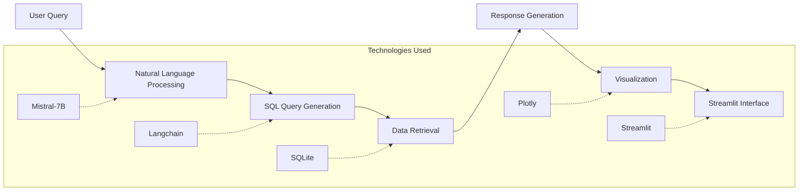

# Maritime Data Analysis Chatbot

## Project Overview
A sophisticated conversational AI system leveraging Mistral-7B and Langchain for maritime/AIS data analysis. This implementation enables natural language interaction with maritime datasets, providing automated analysis and visualization capabilities.

## Key Features
* Natural Language Processing for maritime queries
* Automated SQL query generation from natural language
* Dynamic visualization generation
* Interactive data exploration
* Real-time analysis capabilities

## Technical Architecture



## Project Structure
```
maritime-chatbot/
├── app.py                 # Main Streamlit application
├── config/
│   └── config.yaml       # Configuration settings
├── database/
│   └── db_manager.py     # Database connection and query handling
├── utils/
│   ├── __init__.py
│   ├── visualization.py  # Visualization utilities
│   └── llm_utils.py     # LLM chain utilities
├── chains/
│   ├── __init__.py
│   └── eda_chain.py     # Custom Langchain implementation
├── prompts/
│   └── eda_prompts.py   # System prompts for LLM
└── requirements.txt      # Project dependencies
```

## Technology Stack
- **Frontend**: Streamlit
- **Language Model**: Mistral-7B
- **Database**: SQLite
- **Query Processing**: Langchain
- **Visualization**: Plotly
- **Data Processing**: Pandas, NumPy

## Installation & Setup

1. Clone the repository
```bash
git clone https://github.com/yourusername/maritime-chatbot.git
cd maritime-chatbot
```

2. Install dependencies
```bash
pip install -r requirements.txt
```

3. Launch application
```bash
streamlit run app.py
```

## Usage Examples

### Query Patterns
```python
# Vessel Traffic Analysis
"Show vessel traffic patterns in the last 24 hours"

# Speed Analysis
"Calculate average speed of container ships"

# Port Activity
"Analyze port calls at Rotterdam"

# Route Tracking
"Display trajectory of vessel MARITIME_001"
```

## Data Structure
The system processes maritime data with the following schema:

```sql
vessels (
    mmsi INTEGER PRIMARY KEY,
    vessel_name TEXT,
    vessel_type TEXT,
    length REAL,
    width REAL,
    flag TEXT,
    destination TEXT
)

ais_positions (
    id INTEGER PRIMARY KEY,
    mmsi INTEGER,
    timestamp DATETIME,
    latitude REAL,
    longitude REAL,
    speed REAL,
    course REAL,
    navigation_status TEXT
)
```

## Development Roadmap
- [ ] Real-time AIS data integration
- [ ] Enhanced visualization capabilities
- [ ] Advanced port analytics
- [ ] Multi-language support
- [ ] Performance optimization

## Contributing
1. Fork the repository
2. Create your feature branch (`git checkout -b feature/AmazingFeature`)
3. Commit your changes (`git commit -m 'Add AmazingFeature'`)
4. Push to the branch (`git push origin feature/AmazingFeature`)
5. Open a Pull Request

## Technical Considerations
- GPU recommended for optimal performance
- Supports historical data analysis
- Scalable for large datasets
- Modular architecture for easy extensions

## License
This project is licensed under the MIT License - see the [LICENSE](LICENSE) file for details.

## Contact
- Email: kancharlakoushik8547@gmail.com
- LinkedIn: [Kancharla Koushik](https://www.linkedin.com/in/kancharla-koushik-773bbb16a/)

---
Developed and maintained by Kancharla Koushik
